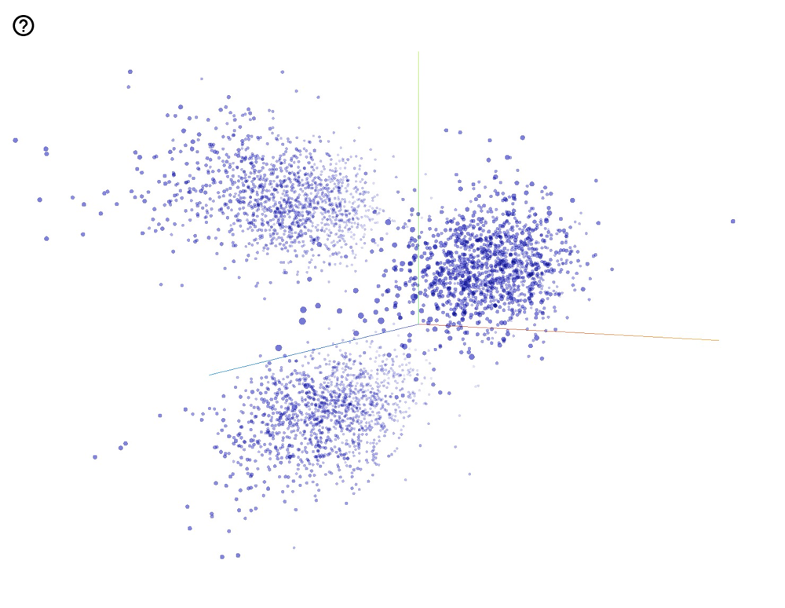

# Relational Embedding for Downstream Machine Learning Tasks

  
## Introduction

  

We apply relational embedding to boost the performance of machine learning models. The relational embedding captures information that exists across multiple tables and could attain a similar level of performance in downstream models with a minimal amount of human effort.

 
We train the embedding in an unsupervised fashion through the following 5-stage pipeline: 

- Dataset Preprocessing
- Textification 
- Graph Generation and Graph Cleaning 
- Embedding Training 
- Feeding Embedding to Downstream ML task 


All of the following used default parameters that could be altered at the user's distinction. 

## Setup 
To setup the environment, run, 
```
pip install -r requirements.txt
```  

The Python version we are using is 3.6.13 and pip version is 21.0.1.

Before running the pipeline on a specific dataset (for example, the sample dataset we are providing), please make sure the following folders are created: 

- Under **data/**, create **strategies/**. This folder would save json files about how tables are textified into tokens when you run data/preprocess.py. 
- Under **node2vec/** and **ProNE/**, create **emb/**. These folders would store embeddings generated from the two different methods. 
- Create **graph/**, and a subfolder under **graph/** with the name of the dataset. This folder would contain dictionary mappings and edgelist files.
- Under **node2vec/**, create a folder named **walks/**, this folder saves the random walks generated in the training process. 

To run the pipeline over your dataset, please add relevant information in data/data_config.txt. 

## Sample Dataset 
The synthetic sample dataset we provide is used as a motivating example to show that embedding is beneficial for boosting downstream model performance. There are mainly three groups of students, type 1, type 2 and type 3. Each group corresponds to transactions of a particular items. The goal is to predict the "money" attribute in the base table. The embedding plot we included below shows that the embedding method correctly clusters all the students into 3 large categories. 


## Dataset Preprocessing
In this stage, we fill relevant dataset information in **data/data_config.txt** and indicate the base table \ columns that we are interested in using for the downstream task. At the same time, we determine the strategies we will be using for each attribute and saved them under **strategies/**.

```
python data/preprocess_data.py --task sample 
```

## Textification and Graph Generation 
We then textified the dataset into text tokens and used text tokens as nodes for the graph generation. There are two groups of edges in our graph -- row nodes, and value nodes. Row nodes represent a row in a specific dataset and value nodes represent values shared across multiple rows. Nodes are linked based on the similarity between their contents. We set thresholds to avoid tokens like "null" and spurious edges. 

```
python generate_graph.py --task sample 
```

Generated graph would be stored as one dictionary and one edgelist under **graph/**. 

## Embedding Training 
We provide two embedding training methods on the graph created from above, one based on random walks and one based on graph factorization methods. The random-walk based one is done by calling: 

```
cd node2vec/ 
python src/main.py --task sample --dimensions 10
```
 
 The factorization-method based one is done by calling: 
 ```
 cd ProNE/ 
python proNE.py --task sample --dimensions 10
 ```

Note that our sample dataset is very small and is just used for motivating example, larger dimensions should be used on larger datasets. 

Generated embedding and walks would be saved in the corresponding **emb/** folder. For the random-walk-based method, we observe due to the connectivity of the graph, some nodes are worse represented than other nodes, and adding limits on how many times walks can visit one node is beneficial for both embedding quality and downstream model performance. The embedding is suffixed with **_restart** under the same model name. The matrix factorization method generates two embeddings, one suffixed with **_sparse** and one with **_spectral** under the same model name. Embeddings generated are saved under the corresponding **emb/** folder. 

## Embedding Enhancement (Optional and Ongoing) 
Since we already have the representation of the relational data in the form of embeddings, we could find analogies of feature engineering techniques in the embedding space. Here are some ideas that we are exploring: 

- Debiasing. If we know the ideal set of features that we would like to use, we could collapse the embedding to some directions that maximize those features so that we both reduce the dimension of the embedding and avoid bias in the downstream ML models at the same time. 
- Dimension Reduction. Since the output of the embedding method would be high dimensional vectors, some downstream models are prone to overfit. Using sparse methods significantly improves downstream model performance in our experiments. Alternatively, is it possible to reduce the dimension without losing too much information? Several dimension reduction method has been tried but they do not exhibit great improvement here. 

## Feeding into Downstream Tasks 
We trained embeddings for row nodes and value nodes that are shared across multiple rows. Therefore, when feeding into downstream models, we also have the option to feed only use the rows / shared values. The default is to use only the row embeddings.

```
python eval_model.py --task sample 
```

It's possible to change the downstream task by altering the evaluation function to be other functions offered in **eval_util**.

## Visualizing embedding 
**convert_emb_to_tsv.py** is a useful tool to convert embeddings from w2v format to tsv format. The tsv format embedding could be plotted in tensorflow projector. Here is a plot of the node2vec embedding for the sample dataset. 
